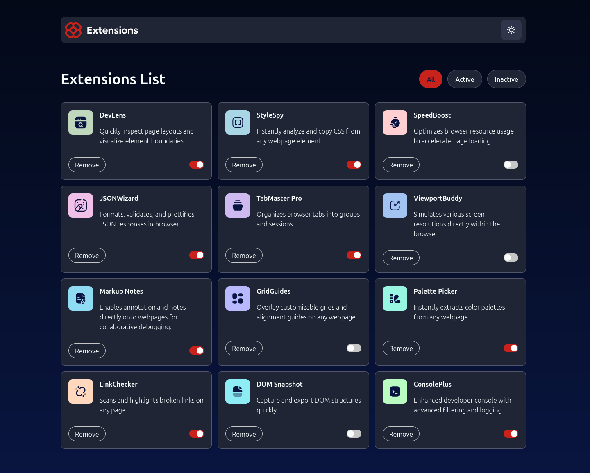

# Frontend Mentor - Browser extensions manager UI solution

This is a solution to the [Browser extensions manager UI challenge on Frontend Mentor](https://www.frontendmentor.io/challenges/browser-extension-manager-ui-yNZnOfsMAp). Frontend Mentor challenges help you improve your coding skills by building realistic projects.

## Table of contents

- [Overview](#overview)
  - [The challenge](#the-challenge)
  - [Screenshot](#screenshot)
  - [Links](#links)
- [My process](#my-process)
  - [Built with](#built-with)
  - [What I learned](#what-i-learned)
  - [Continued development](#continued-development)
  - [Useful resources](#useful-resources)
- [Author](#author)

## Overview

### The challenge

Users should be able to:

- Toggle extensions between active and inactive states
- Filter active and inactive extensions
- Remove extensions from the list
- Select their color theme
- View the optimal layout for the interface depending on their device's screen size
- See hover ~~and focus~~ states for all interactive elements on the page

### Screenshot

### Links

- Solution URL: [https://www.frontendmentor.io/solutions/browser-extension-manager-ui-with-react-and-typescript-hdC5m27Sn6](https://www.frontendmentor.io/solutions/browser-extension-manager-ui-with-react-and-typescript-hdC5m27Sn6)
- Live Site URL: [https://florianstancioiu.github.io/browser-extensions-manager-ui/](https://florianstancioiu.github.io/browser-extensions-manager-ui/)

## My process

### Built with

- Semantic HTML5 markup
- CSS custom properties
- Flexbox
- CSS Grid
- Mobile-first workflow
- [React](https://reactjs.org/) - JS library
- [TailwindCSS](https://tailwindcss.com/) - For styles
- [TypeScript](https://www.typescriptlang.org/) - JavaScript superset

### What I learned

- I'm really happy I made this project work correctly with TypeScript, in hindsight, this was very simple, but I got distracted by the fact that Vite requires you to import types using the `type` keyword (this was the biggest challenge I had to overcome in this project I think).
- I learned about the new `@theme` directive in TailwindCSS, I learned to use the newest version of Tailwind (v4).
- I re-learned how to add SVG files as components in React.
- I'm not gonna lie, at first, the filtering of the extensions items did give me a headache but in the end, I managed to complete the task.

### Continued development

- I think I missed out when I decided to skip the focus states for this project, I'm not sure if every single link will be treated as a focus element or not. I might come back to this project later to see if that is true or not.

- I also didn't use localStorage to set the dark mode "permanently".
- I would also come back and change every single px value to it's rem corespondent.

### Useful resources

- [Vite Plugin SVGR](https://www.npmjs.com/package/vite-plugin-svgr) - This helped me to include SVGs as React components in JSX
- [How do I add color to my svg image in react](https://stackoverflow.com/a/62532186/12159189) - StackOverflow answer I found useful
- [Why does my Vue/Vite/Typescript application require me to separate "import" and "import type" by default?](https://stackoverflow.com/a/76984656/12159189) - A StackOverflow answer I found useful when dealing with TypeScript
- [Toggling dark mode manually](https://tailwindcss.com/docs/dark-mode#toggling-dark-mode-manually) - A TailwindCSS feature I used
- [@theme directive](https://tailwindcss.com/docs/functions-and-directives#theme-directive) - A relatively new TailwindCSS feature (v4) I used

## Author

- Frontend Mentor - [@florianstancioiu](https://www.frontendmentor.io/profile/florianstancioiu)
- Threads - [@florianstancioiu01](https://www.threads.com/@florianstancioiu01)
- LinkedIn - [@florianstancioiu](https://www.linkedin.com/in/florian-stancioiu-765661349/)
- freeCodeCamp - [florianstancioiu](https://www.freecodecamp.org/florianstancioiu)
